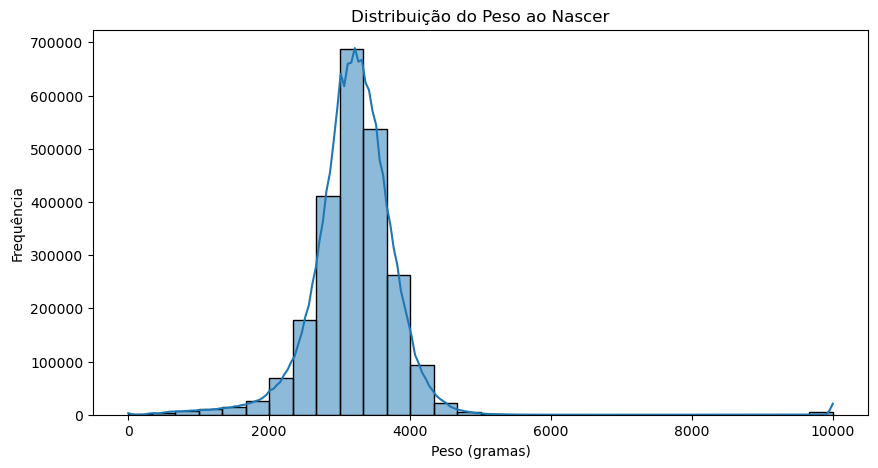
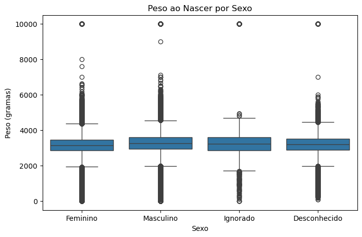
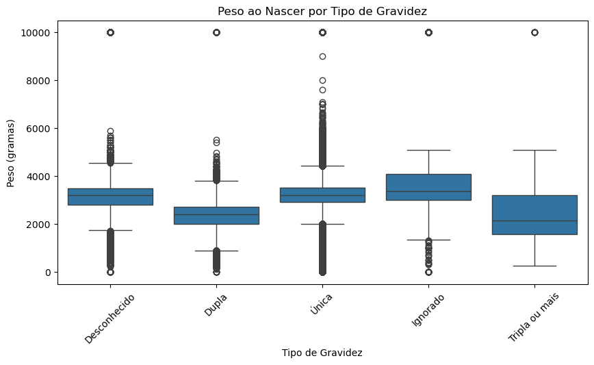
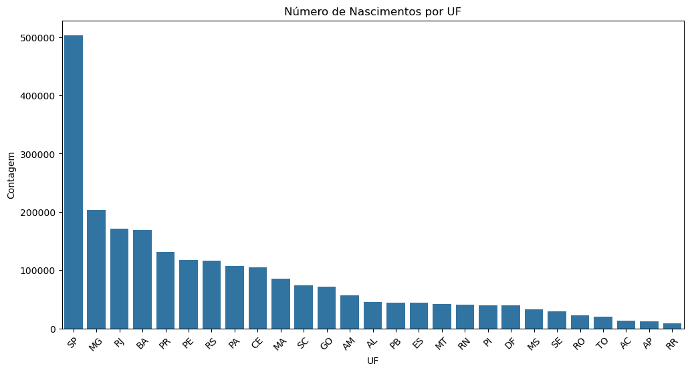

# *Aprendizagem de Máquina - Análise dos Resultados*

Na etapa anterior, apresentamos o código de construção e avaliação dos modelos XGBoost, Ridge Regression e Random Forest. Nesta etapa, expandimos a análise com duas abordagens principais:

- **Adição de Novas Métricas**
Incluímos métricas complementares que ajudam a entender melhor os erros cometidos pelos modelos, considerando diferentes perspectivas.

- **Geração de Gráficos da Base Final (Gold)**
Foram criadas visualizações gráficas com base nos dados finais pré-processados, permitindo observar tendências e padrões relevantes que auxiliam na interpretação dos resultados preditivos.

Após o treinamento e avaliação, aprofundamos a comparação dos modelos usando esse conjunto mais abrangente de métricas para avaliar a performance preditiva sobre o peso ao nascer.

Além das métricas tradicionais (MAE, RMSE, R², EVS e MedAE), incorporamos:

- **MSLE (Erro Logarítmico Quadrático Médio)**
- **RMSLE (Raiz do MSLE)**
- **MaxError (Erro Máximo)**

Essas métricas ajudam a entender não apenas o erro médio, mas também o impacto de grandes desvios e a robustez dos modelos.

---

## Resultados Detalhados das Métricas

| **Modelo**                             | **MAE** | **RMSE** | **R²**   | **EVS**  | **MedAE** | **RMSLE** | **MaxError** |
|----------------------------------------|---------|----------|----------|----------|-----------|-----------|--------------|
| XGBoost (n=100, lr=0.1)                | 406.32  | 599.68   | 0.1235   | 0.1235   | 305.16    | 0.1768    | 2786.61      |
| XGBoost (n=200, lr=0.05)               | 406.33  | 599.84   | 0.1230   | 0.1230   | 304.94    | 0.1768    | 2790.14      |
| Ridge (α=1)                            | 409.44  | 611.59   | 0.0884   | 0.0884   | 306.35    | 0.1795    | 2915.77      |
| Ridge (α=10)                           | 409.44  | 611.59   | 0.0884   | 0.0884   | 306.35    | 0.1795    | 2915.78      |
| Random Forest (n=20, d=5)              | 408.60  | 609.31   | 0.0947   | 0.0947   | 306.37    | 0.1791    | 2849.52      |
| Random Forest (n=50, d=10)             | 407.40  | 601.94   | 0.1169   | 0.1169   | 306.48    | 0.1776    | 2801.20      |

---

## Interpretação Ampliada das Métricas

#### 1. **MAE (Erro Absoluto Médio)**

- Indica o erro médio entre os valores previstos e os reais. O XGBoost apresentou os menores valores (≈406g), o que reflete melhor desempenho na média das predições.

- A Ridge Regression teve os maiores MAEs, sugerindo menor precisão geral.

#### 2. **MedAE (Erro Absoluto Mediano)**

- Menos sensível a outliers, mostra o erro típico nas previsões. Novamente, o XGBoost se destacou com os menores valores (≈305g), mostrando maior consistência.

#### 3. **RMSE (Raiz do Erro Quadrático Médio)**

- Penaliza fortemente grandes erros. O XGBoost obteve os menores RMSEs (≈599g), indicando menor ocorrência de grandes desvios.

- A Ridge Regression foi a pior nesse critério, com erros mais dispersos.

#### 4. **MaxError (Erro Máximo)**

- Mede o maior erro individual cometido pelo modelo. O XGBoost teve o menor MaxError (≈2786g), reforçando sua robustez contra grandes desvios.

- A Ridge Regression com α=10 teve o maior erro máximo, passando de 2900g.

#### 5. **R² (Coeficiente de Determinação)**

- Mede a proporção da variância explicada pelo modelo. O melhor valor foi com o XGBoost (0.1235), mas ainda indica que menos de 13% da variação do peso foi explicada — mostrando que há espaço para melhorias nos dados e no modelo.

#### 6. **EVS (Explained Variance Score)**

- Métrica semelhante ao R². Também liderada pelo XGBoost (0.1235), confirmando que ele é o que melhor representa a variabilidade dos dados.

#### 7. **RMSLE (Raiz do Erro Logarítmico Quadrático Médio)**

- Considera o log dos valores, penalizando menos erros em valores maiores. É útil quando os dados possuem grandes variações.

- O XGBoost novamente apresentou os menores valores (0.1768), mostrando bom desempenho relativo mesmo quando os dados são transformados para escala logarítmica.

- A Ridge Regression apresentou os maiores RMSLEs (>0.179), sugerindo desempenho inferior também sob essa perspectiva.

---

## Gráficos

#### **Distribuição do Peso ao Nascer:** 
- O primeiro gráfico é um histograma com uma curva de densidade, mostrando a distribuição do peso de recém-nascidos (em gramas). A maioria dos bebês nasce com peso entre 2.500 e 4.000 gramas, com um pico próximo de 3.500 gramas. Pesos muito baixos (abaixo de 1000g) ou muito altos (acima de 5000g) são raros.

#### **Peso ao Nascer por Sexo:** 
- O segundo gráfico é um boxplot que compara o peso ao nascer por sexo (Feminino, Masculino, Ignorado, Desconhecido). Bebês do sexo masculino tendem a ter um peso médio maior que os do sexo feminino. As categorias “Ignorado” e “Desconhecido” possuem poucos dados e maior variabilidade.

#### **Peso ao Nascer por Tipo de Gravidez:** 
- O terceiro gráfico, também um boxplot, mostra o peso ao nascer por tipo de gravidez (Desconhecida, Dupla, Única, Ignorada, Tripla ou mais). Bebês de gestações únicas têm peso médio maior (próximo de 3000g), enquanto gestações múltiplas (dupla, tripla ou mais) resultam em pesos menores, com mais variabilidade.

#### **Número de Nascimentos por UF:** 
- O quarto gráfico é um histograma mostrando a contagem de nascimentos por Unidade Federativa (UF). São Paulo (SP) lidera com mais de 500 mil nascimentos, seguido por Minas Gerais (MG) e Rio de Janeiro (RJ). Estados como Roraima (RR) e Amapá (AP) têm os números menores, abaixo de 10.000.

---

## Conclusão

- **Modelo Mais Eficiente:** O **XGBoost** permanece como o modelo mais eficiente para prever o peso ao nascer, com o melhor desempenho nas principais métricas.
- **Random Forest** ficou em segundo lugar, especialmente no segundo experimento (n=50, profundidade=10), mostrando melhora em relação ao experimento anterior.
- **Ridge Regression** teve os piores resultados, indicando que modelos lineares com regularização simples não capturam bem a complexidade dos dados.

---

## Recomendações

**Realizar otimização de hiperparâmetros:** 
Aplicar técnicas como Grid Search, Random Search ou Bayesian Optimization para encontrar a melhor combinação de parâmetros para cada modelo e melhorar o desempenho preditivo.

**Testar modelos adicionais:** 
Avaliar outros algoritmos de regressão, como LightGBM, CatBoost, Gradient Boosting tradicional e redes neurais, para verificar se oferecem ganhos em precisão e robustez.

**Considerar mais variáveis explicativas:** 
Explorar a inclusão de novas variáveis no conjunto de dados, realizar engenharia de atributos e selecionar variáveis com maior poder preditivo, com base em análises estatísticas ou de importância de features.
