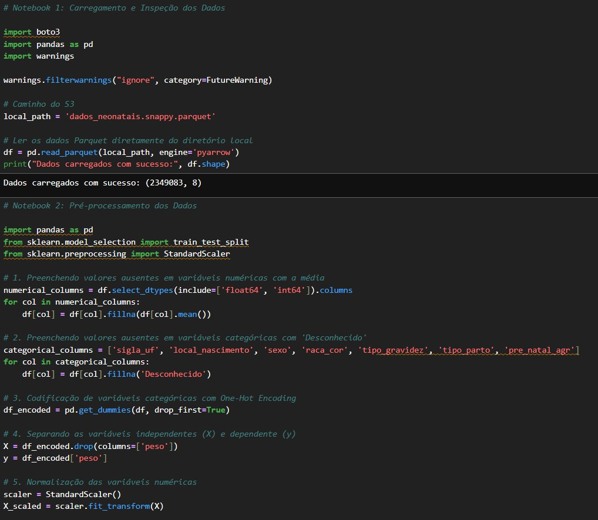
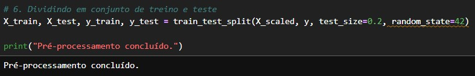
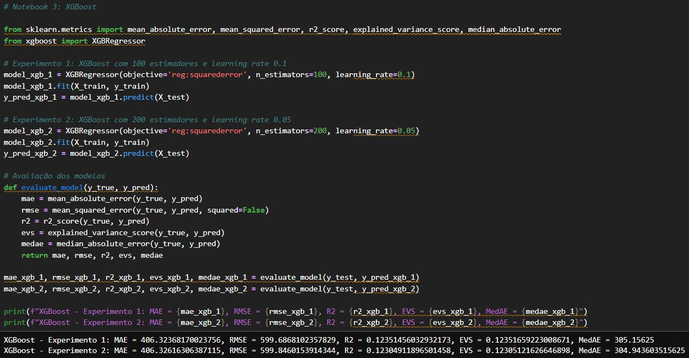
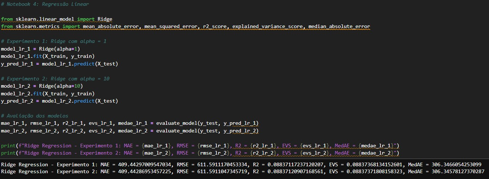
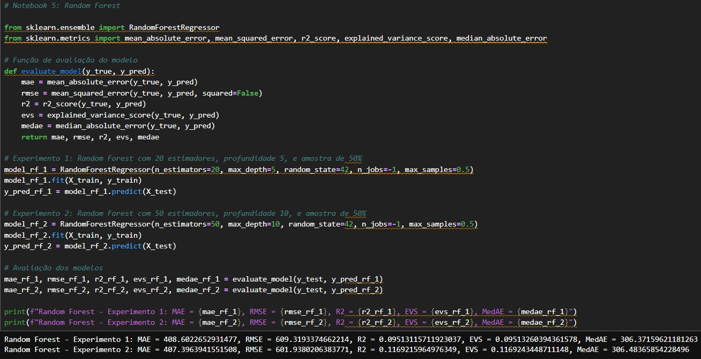

# *Aprendizagem de Máquina - Avaliação dos Modelos*

Com a tabela **Gold**, que é a versão final dos dados, aplicamos três modelos de aprendizagem de máquina para prever o peso ao nascer:

- **XGBoost Regressor**
- **Ridge Regression**
- **Random Forest Regressor**

Esses modelos foram treinados com 80% dos dados e avaliados com 20% dos dados de teste, utilizando as seguintes métricas de desempenho:

1. **MAE (Erro Absoluto Médio)**
2. **RMSE (Raiz do Erro Quadrático Médio)**
3. **R² (Coeficiente de Determinação)**
4. **EVS (Explained Variance Score)**
5. **MedAE (Erro Absoluto Mediano)**

---

## Etapas do Processo de Aprendizagem de Máquina

1. **Pré-processamento dos Dados**
   
   Antes de treinar os modelos, os dados passaram por um pré-processamento que incluiu:
   - Carregamento dos dados da tabela Gold para o ambiente no Jupyter Notebook.
   - Preenchimento de valores ausentes, usando a média para variáveis numéricas e "Desconhecido" para variáveis categóricas.
   - Codificação de variáveis categóricas usando **One-Hot Encoding**.
   - Normalização das variáveis numéricas utilizando o **StandardScaler**, para que todas as variáveis tivessem uma escala similar e o modelo não fosse tendencioso por magnitudes desiguais.

2. **Divisão dos Dados**
   
   Os dados foram divididos em 80% para treinamento e 20% para teste, com o `random_state=42` garantindo a reprodutibilidade dos resultados.

3. **Treinamento dos Modelos**
   
   Três modelos foram treinados:
   - **XGBoost Regressor**: Utilizamos duas variações no número de estimadores (100 e 200) e taxa de aprendizado (0.1 e 0.05).
   
   

   - **Ridge Regression**: Testamos duas configurações de regularização com o parâmetro **alpha** (1 e 10).

   

   - **Random Forest Regressor**: Realizamos dois experimentos, variando o número de estimadores (20 e 50) e a profundidade das árvores (5 e 10).

   

 

---

## Resultados e Análise dos Indicadores

| **Modelo**                             | **MAE**    | **RMSE**   | **R²**     | **EVS**    | **MedAE**  |
|----------------------------------------|------------|------------|------------|------------|------------|
| XGBoost (n=100, lr=0.1)               | 406.324    | 599.687    | 0.124      | 0.124      | 305.156    |
| XGBoost (n=200, lr=0.05)              | 406.326    | 599.846    | 0.123      | 0.123      | 304.944    |
| Ridge (α=1)                           | 409.443    | 611.591    | 0.088      | 0.088      | 306.347    |
| Ridge (α=10)                          | 409.443    | 611.591    | 0.088      | 0.088      | 306.346    |
| Random Forest (n=20, d=5)             | 408.602    | 609.319    | 0.095      | 0.095      | 306.372    |
| Random Forest (n=50, d=10)            | 407.396    | 601.938    | 0.117      | 0.117      | 306.484    |

---

## Explicação dos Indicadores e Avaliação

1. **MAE (Erro Absoluto Médio):**
   - **Interpretando:** Quanto menor o MAE, melhor o modelo. O valor de 406 (para o XGBoost) significa que, em média, o modelo erra por 406 gramas no peso ao nascer.
   - **Avaliação:** Esse valor indica um erro razoável, mas ainda há espaço para melhorias, principalmente considerando que o erro médio está acima de 400 gramas.

2. **RMSE (Raiz do Erro Quadrático Médio):**
   - **Interpretando:** O RMSE penaliza mais erros grandes. Um RMSE de 600 indica que o modelo tem uma tendência de cometer erros significativos, especialmente em predições mais distantes.
   - **Avaliação:** A presença de erros mais altos (RMSE de cerca de 600) sugere que o modelo pode ser aprimorado, principalmente na redução de grandes desvios.

3. **R² (Coeficiente de Determinação):**
   - **Interpretando:** O R² de 0.124 (XGBoost) indica que o modelo só explica 12.4% da variabilidade do peso ao nascer.
   - **Avaliação:** Um valor de R² baixo sugere que o modelo não está capturando bem a variabilidade dos dados e que melhorias são necessárias, como a adição de mais variáveis ou ajustes no modelo.

4. **EVS (Explained Variance Score):**
   - **Interpretando:** O EVS, com valores de 0.124, é semelhante ao R², indicando que o modelo está explicando apenas uma pequena parte da variabilidade dos dados.
   - **Avaliação:** Este valor baixo reforça a necessidade de otimizar o modelo e buscar formas de melhorar a explicação da variabilidade dos dados.

5. **MedAE (Erro Absoluto Mediano):**
   - **Interpretando:** A MedAE de 304 (XGBoost) é uma boa indicação da precisão do modelo, sendo menos sensível a outliers.
   - **Avaliação:** A MedAE mais baixa no XGBoost (304.944) sugere que este modelo tem uma maior consistência nas predições, tornando-o mais confiável do que os outros modelos testados.

---

## Conclusão

- **Melhor Modelo:** O **XGBoost** apresentou o melhor desempenho geral, com o menor MAE e RMSE, além de um EVS e R² ligeiramente melhores que os outros modelos. No entanto, a explicação da variabilidade (R² e EVS) ainda é baixa, indicando que melhorias são necessárias para capturar mais variabilidade dos dados.

- **Limitações do Ambiente de Execução:** Durante a execução, a máquina utilizada no ambiente de **LAB da AWS** apresentou **limitações de memória**, resultando em **reinícios do kernel** ao tentar carregar muitas variáveis ou grandes volumes de dados. Isso impactou a performance do modelo, já que a máquina não conseguiu processar todas as variáveis disponíveis, prejudicando o treinamento e a avaliação.

- **Próximos Passos:** Para melhorar os resultados, seria interessante:
  - Experimentar otimização de hiperparâmetros (ex: **Grid Search**, **Random Search**).
  - Considerar novas variáveis que possam ter um impacto maior no peso ao nascer.
  - Tentar técnicas de **ensemble** (como o stacking de modelos) para combinar as forças dos diferentes modelos.
  - Verificar opções de upgrade de máquina para evitar limitações de memória, permitindo o processamento de dados mais complexos.
